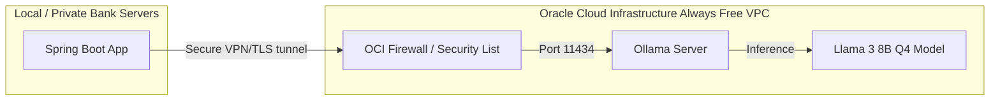

# Enterprise Guide: Deploying a Private LLM on Oracle Cloud Always Free

This guide walks you through deploying a fully private, secure, and cost-free Large Language Model (LLM) on **Oracle Cloud Infrastructure (OCI) Always Free Tier** and connecting it to your Spring Boot Banking application. 

This architecture ensures that **100% of customer transaction data stays inside your private network perimeter** and is never shared with third-party public cloud providers (like OpenAI or OpenRouter).

---

## Architecture Overview



---

## Phase 1: Provisioning the OCI Always Free Server

Oracle Cloud offers an incredibly generous **Always Free** tier that includes ARM-based Ampere servers with up to **4 CPUs and 24 GB of RAM**. Because running LLMs on CPUs is purely memory-bound, 24 GB of RAM is plenty of overhead to host a quantized Llama 3 model at production speeds.

### Step 1: Sign up for Oracle Cloud Free Tier
1. Go to [oracle.com/cloud/free](https://www.oracle.com/cloud/free/) and register for an account.
2. During setup, select your **Home Region** close to your location or where your application servers run.

### Step 2: Create a Compute Instance
1. In the OCI Console, navigate to **Compute** -> **Instances** -> **Create Instance**.
2. **Placement**: Choose the default Availability Domain.
3. **Image and Shape**:
   * Click **Edit**.
   * Click **Change Image** and select **Ubuntu 22.04 LTS (Minimal or Standard)**.
   * Click **Change Shape** and select **Ampere (ARM-based)**.
   * Allocate: **4 OCPUs** and **24 GB of RAM** (or whatever maximum amount your free tier allows).
4. **Networking**:
   * Select **Create a new Virtual Cloud Network (VCN)**.
   * Ensure a **Public IP address** is assigned.
5. **SSH Keys**:
   * Save the Private Key and Public Key to your computer. (You will need the private key to SSH into the machine: `chmod 400 <key_name>.key`).
6. Click **Create** and wait 2-3 minutes for the instance status to show **RUNNING**.

### Step 3: Open Port 11434 in the OCI Firewall
To allow your Spring Boot app to connect to the Ollama server, you must open port `11434` in the Virtual Cloud Network (VCN) firewall:
1. On your instance details page, under **Instance Information**, click on your **Virtual Cloud Network**.
2. Click on **Security Lists** in the left sidebar, and click on the **Default Security List**.
3. Click **Add Ingress Rules** and enter:
   * **Source CIDR**: `0.0.0.0/0` (Or restrict this specifically to your Spring Boot server's public IP address for enterprise-grade security).
   * **IP Protocol**: `TCP`
   * **Source Port Range**: `All`
   * **Destination Port Range**: `11434`
   * **Description**: `Ollama Local LLM API`
4. Click **Add Ingress Rules**.

---

## Phase 2: Installing and Configuring Ollama on the Server

Now, let's log into your new server via SSH and set up the private LLM.

### Step 1: SSH into your Oracle Instance
Run the following in your local terminal:
```bash
ssh -i /path/to/your/private_key.key ubuntu@<YOUR_ORACLE_PUBLIC_IP>
```

### Step 2: Open the Local Ubuntu Firewall for Port 11434
Ubuntu has a built-in firewall (`iptables` / `ufw`) that by default blocks all inbound traffic. Run these commands on the server to open port 11434:
```bash
sudo ufw allow 11434/tcp
sudo ufw reload
```

### Step 3: Install Ollama
Run the official installation script:
```bash
curl -fsSL https://ollama.com/install.sh | sh
```

### Step 4: Configure Ollama to Listen Globally
By default, Ollama only listens to `localhost` (port 127.0.0.1). We need it to bind to `0.0.0.0` so your Spring Boot application can connect.
1. Edit the systemd service file:
   ```bash
   sudo systemctl edit ollama.service
   ```
2. This opens an empty override file. Paste the following configuration precisely:
   ```ini
   [Service]
   Environment="OLLAMA_HOST=0.0.0.0"
   ```
3. Save and close the editor (if using nano, press `Ctrl+O`, `Enter`, then `Ctrl+X`).
4. Reload systemd and restart the service:
   ```bash
   sudo systemctl daemon-reload
   sudo systemctl restart ollama
   ```
5. Verify the service is running and listening globally:
   ```bash
   netstat -tuln | grep 11434
   # You should see: tcp6  0  0 :::11434  :::*  LISTEN
   ```

### Step 5: Pre-Pull the Llama 3 Model
Download the high-performance Llama 3 8B model:
```bash
ollama pull llama3
```

---

## Phase 3: Connecting Your Spring Boot Application

Now that your private server is hosting the LLM, let's configure your Spring Boot application to route all fraud evaluations to it.

### Step 1: Update your dependency in `pom.xml`
Swap the OpenAI client for the Ollama client in your [pom.xml](file:///Users/vedantgadge1512/VG%20Codes/Banking/BankingProject/pom.xml#L53-L57):

```xml
        <dependency>
            <groupId>org.springframework.ai</groupId>
            <artifactId>spring-ai-ollama-spring-boot-starter</artifactId>
            <version>1.0.0-M6</version>
        </dependency>
```

### Step 2: Update `application.properties`
Modify your `src/main/resources/application.properties` file:

```properties
# =====================
# Private Cloud AI Config (Ollama on Oracle Cloud)
# =====================
spring.ai.ollama.base-url=http://<YOUR_ORACLE_PUBLIC_IP>:11434
spring.ai.ollama.chat.options.model=llama3
spring.ai.ollama.chat.options.temperature=0.2
```

---

## Phase 4: Verification

1. Run your Spring Boot application locally.
2. Initiate a high-risk transaction (e.g., $15,000) via your REST API.
3. In your Java log file, you will see your `RiskExplanationService` logs:
   ```text
   [risk-explanation] llm call start transactionId=123 riskLevel=HIGH
   ```
4. The application will route the request to your Oracle Cloud instance, run the calculation securely on your private server, and save the generated risk summary to the local database.
5. In your Oracle terminal, you can monitor resource usage:
   ```bash
   top
   # Watch the CPU cores execute the inference securely!
   ```
