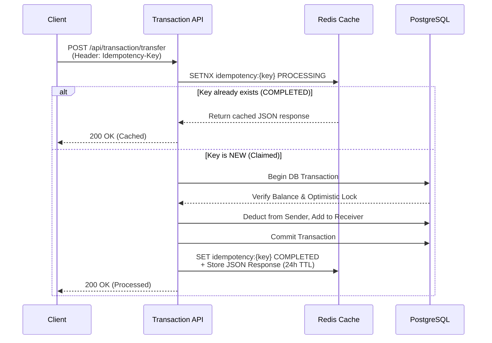

# Core Banking & Risk AI Transaction System

A production-ready, modular monolith banking application that processes financial transactions, evaluates real-time fraud risk using LLM-based logic, and ensures strict consistency through idempotency and rate-limiting.


**Live API Documentation:** [Swagger UI on Render](https://banking-java.onrender.com/swagger-ui/index.html#/)

---

## 🎯 Purpose & The Problem It Solves

**The Problem:**
In financial systems, moving money is not just about updating two database rows. If a user's network drops during a transfer and they click "Send" twice, they could be charged twice (the "Double Spend" problem). If a malicious actor creates a new account and immediately transfers $10,000, the system must detect it instantly. Furthermore, APIs must be protected from DDoS attacks and brute-force abuse.

**The Solution:**
This project solves these enterprise challenges by implementing:
1. **Idempotency (via Redis `SETNX`):** Guarantees exactly-once processing. If a client retries a transaction, the exact same response is safely returned from the Redis cache without hitting the database or double-charging.
2. **AI-Powered Fraud Engine:** A rule-based scoring engine evaluates account age, transaction velocity, and behavioral signals in real-time. If a transaction crosses a high-risk threshold, it is automatically rejected, and an LLM (OpenRouter) generates an asynchronous human-readable fraud report.
3. **Optimistic Locking & ACID Compliance:** Transactions are strictly consistent. You cannot transfer money you don't have, and race conditions are mitigated natively by JPA Optimistic Locking.
4. **Resilience & Protection:** A custom Redis-backed Rate Limiter prevents abuse, failing open if Redis crashes to prioritize API availability.

---

## 🏗 Architecture & Data Flow

### System Architecture
The application follows a **Modular Monolith** pattern. This provides the deployment simplicity of a single application while keeping domain boundaries (User, Account, Transaction, Risk) strictly separated, allowing for easy extraction into microservices in the future.

```mermaid
graph TD
    Client([Mobile / Web Client])
    Gateway[API Gateway / Rate Limiter]
    
    subgraph Modular Monolith
        Auth[Auth Module\nJWT Security]
        Acc[Account Module\nLedger]
        Tx[Transaction Module\nOrchestrator]
        Risk[Risk Engine\nAsync ThreadPool]
    end

    Redis[(Redis Cache)]
    Postgres[(PostgreSQL\nCore Database)]
    LLM([OpenRouter AI\nFraud Explanations])

    Client -->|HTTP / JSON| Gateway
    Gateway -->|Check limit| Redis
    Gateway --> Auth
    Auth --> Tx
    
    Tx <-->|Claim Idempotency Key| Redis
    Tx -->|Verify Balance| Acc
    Tx -->|Persist Tx| Postgres
    Acc -->|Update Ledger| Postgres
    
    Tx -.->|@Async Fire-and-Forget| Risk
    Risk -.->|Fraud Analysis| LLM
```

### Idempotent Transaction Flow (The Double-Spend Solution)
When a client initiates a transfer, they provide a unique `Idempotency-Key` header (usually a UUID).



---

## ✨ Enterprise-Grade Features

*   **Database Schema Versioning:** Handled via **Flyway Migrations**. No dangerous `ddl-auto=update` in production.
*   **Security Hardening:** 
    *   JWT secrets are strictly validated via `@PostConstruct` (must be 256-bit+).
    *   Docker container runs as a least-privilege `non-root` user on Alpine Linux.
    *   CI Pipeline uses **Trivy** to scan the Docker image for CVE vulnerabilities before deployment.
*   **Structured Logging & Observability:** Logs are emitted in JSON via Logstash Encoder for easy ingestion by Datadog/ELK. Health probes are exposed via Spring Boot Actuator.
*   **Graceful Degradation:** Redis rate limiting and idempotency blocks catch `RedisConnectionFailureException`. If Redis dies, the application logs a warning and falls back to processing transactions (availability over strictness), rather than crashing.

---

## 🛠 Tech Stack

| Layer | Technology |
|-------|-----------|
| **Core Framework** | Spring Boot 3.2, Java 17 |
| **Database** | PostgreSQL 15, Spring Data JPA |
| **Migrations** | Flyway |
| **Caching / Distributed Locks** | Redis (Bucket4j concept implemented manually) |
| **Security** | Spring Security, JWT (jjwt) |
| **AI Integration** | OpenRouter REST API (GPT/OSS Models) |
| **Observability** | Spring Boot Actuator, Logback JSON Encoder |
| **Testing** | JUnit 5, Mockito (40+ Coverage Tests) |

---

## 🚀 Quick Start

### Prerequisites
- Docker & Docker Compose
- Java 17+ (If running without Docker)

### Local Development (Zero Setup via Docker)

1. Clone the repository and configure your environment:
```bash
git clone <repo-url>
cd BankingProject
cp .env.example .env.properties
# (Optional) Add your OPENROUTER_API_KEY to .env.properties to test AI explanations
```

2. Spin up the entire infrastructure (Database, Redis, and Application):
```bash
docker compose up -d --build
```

The application will automatically run Flyway migrations and start on `http://localhost:8080`.
*   **API Docs:** `http://localhost:8080/swagger-ui/index.html`

### Running Tests
The project features 40+ high-value tests covering edge cases, negative paths, and risk engine logic.
```bash
./mvnw clean test
```

---

## 📚 API Documentation

Once running, access the interactive Swagger UI. Below are the core endpoints:

#### 1. Authentication
*   `POST /api/auth/register` - Register a new user
*   `POST /api/auth/login` - Obtain a JWT token

#### 2. Transactions
*   `POST /api/transaction/transfer` - Transfer money (Supports `Idempotency-Key` header)
*   `GET /api/transaction/history` - Get paginated transaction history

#### 3. Accounts
*   `POST /api/accounts` - Open a new account
*   `GET /api/accounts/user/{userId}` - View balance

---

## 🗄 Database Schema (Flyway V1)

```sql
CREATE TABLE users (
  id BIGSERIAL PRIMARY KEY,
  email VARCHAR(255) UNIQUE NOT NULL,
  password VARCHAR(255) NOT NULL,
  role VARCHAR(255) NOT NULL DEFAULT 'USER',
  created_at TIMESTAMP NOT NULL DEFAULT CURRENT_TIMESTAMP
);

CREATE TABLE accounts (
  id BIGSERIAL PRIMARY KEY,
  user_id BIGINT UNIQUE NOT NULL,
  balance NUMERIC(38,2) NOT NULL DEFAULT 0.00,
  created_at TIMESTAMP NOT NULL DEFAULT CURRENT_TIMESTAMP,
  FOREIGN KEY (user_id) REFERENCES users(id)
);

CREATE TABLE transaction (
  id BIGSERIAL PRIMARY KEY,
  type VARCHAR(255) NOT NULL,
  status VARCHAR(255) NOT NULL,
  amount NUMERIC(38,2) NOT NULL,
  from_user_id BIGINT,
  to_user_id BIGINT,
  created_at TIMESTAMP NOT NULL DEFAULT CURRENT_TIMESTAMP
);
```

---

## 🤝 Contributing
1. Create a feature branch (`git checkout -b feature/amazing-feature`)
2. Ensure tests pass (`./mvnw test`)
3. Commit changes (`git commit -m 'feat: add amazing feature'`)
4. Push to branch (`git push origin feature/amazing-feature`)
5. Open a Pull Request
