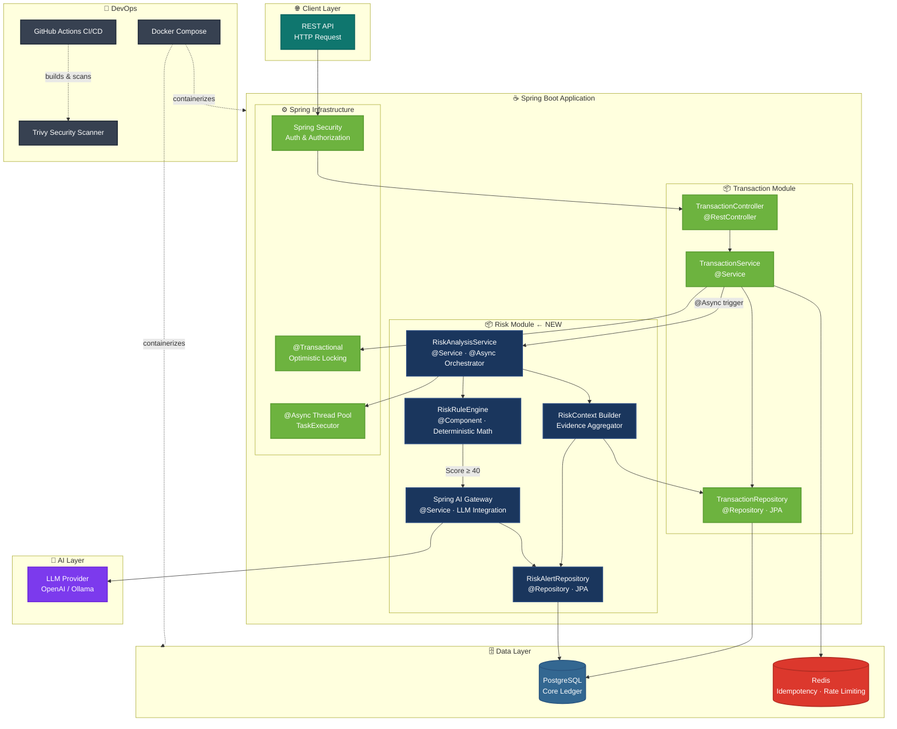
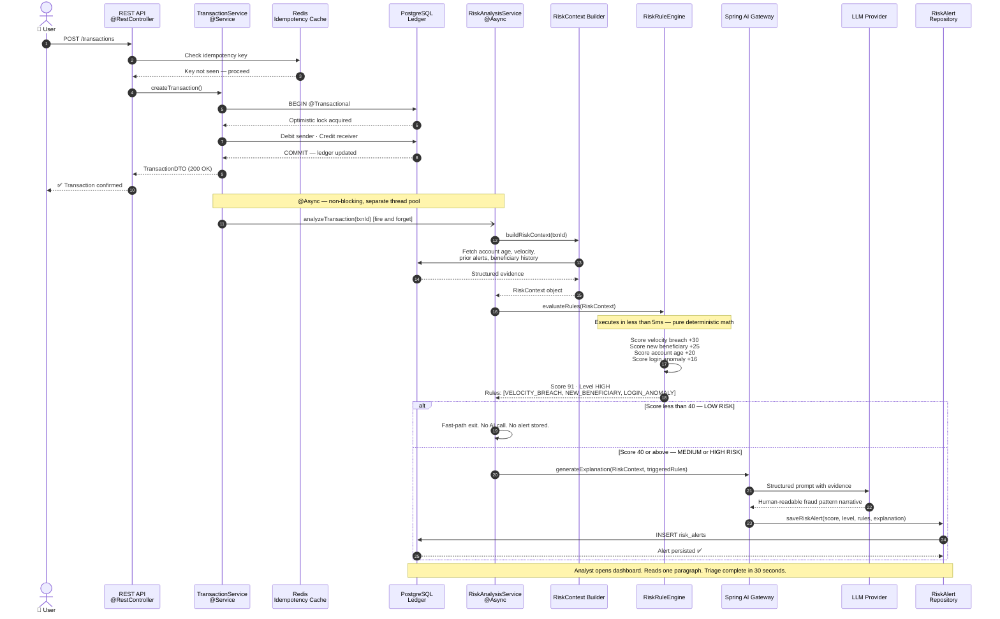
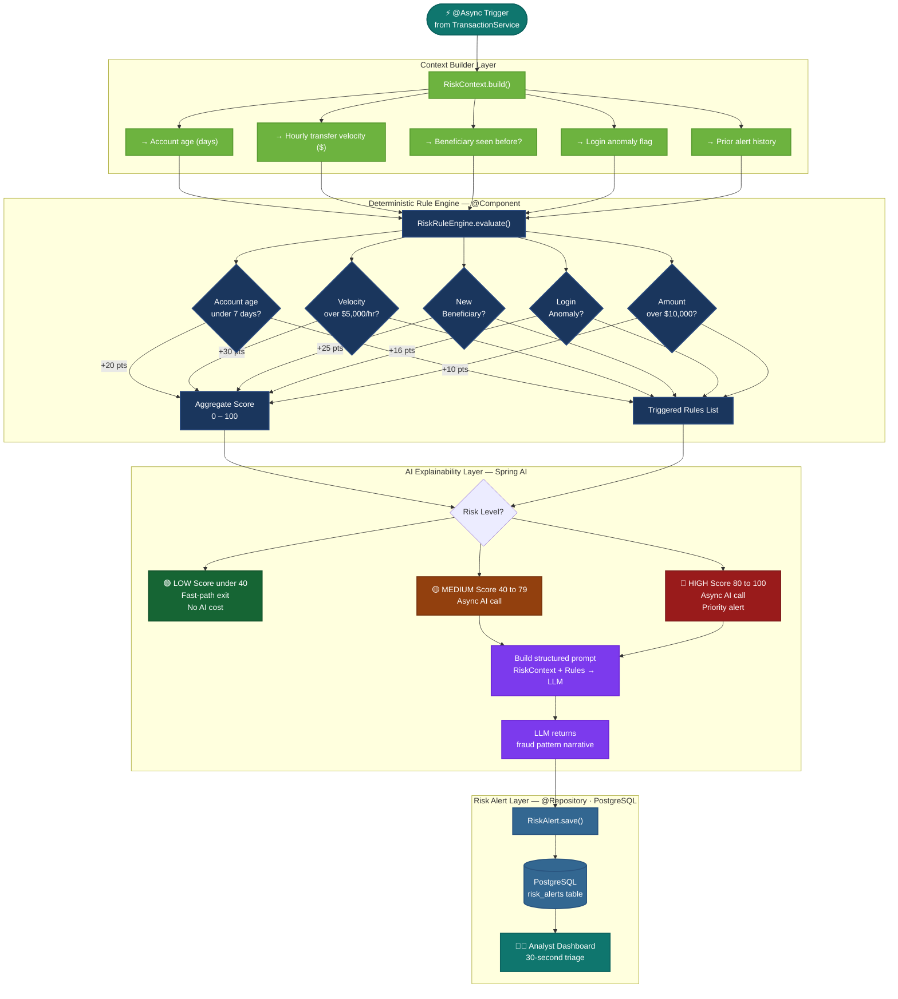

# 🏦 Hybrid Banking Risk Intelligence & Alert Triage System

[](https://adoptium.net/)
[](https://spring.io/projects/spring-boot)
[](https://www.postgresql.org/)
[](https://redis.io/)
[](https://spring.io/projects/spring-ai)

> **A bank-internal operational intelligence platform — not a chatbot.**
> Built for fraud, risk, and compliance analysts to triage suspicious activity in seconds, not minutes.

---

## The Problem This Solves

Legacy fraud systems hand analysts an error code: `ERR-798`.

The analyst then spends **30 minutes** opening five different systems — transaction logs, account history, velocity reports, beneficiary records — to piece together what actually happened. At scale, this is unsustainable. Analyst teams are drowning in alerts, and the important ones get missed.

This system changes that. Every flagged transaction arrives with a **complete, human-readable fraud case summary** already written.

---

## Spring Boot Application Architecture

The system is built as a **modular monolith** in Spring Boot — a deliberate choice for banking systems where operational simplicity, transactional consistency, and deployment predictability matter more than microservice flexibility.



---

## End-to-End Data Flow

How a single transaction moves through the entire system — from API call to analyst alert.



---

## Risk Module — Internal Component Flow

A closer look at what happens inside the `risk/` module between context building and alert generation.



---

## Module Structure

```
risk/                              ← New module built on top of existing Spring Boot app
├── dto/
│   ├── RiskAlertDTO.java          # API response shape
│   └── RiskContextDTO.java        # Structured evidence passed between layers
├── entity/
│   └── RiskAlert.java             # @Entity — persisted alert record
├── enums/
│   └── RiskLevel.java             # LOW · MEDIUM · HIGH
├── repository/
│   └── RiskAlertRepository.java   # @Repository — JpaRepository<RiskAlert, UUID>
└── service/
    ├── RiskAnalysisService.java    # @Service @Async — orchestrates both paths
    └── RiskRuleEngine.java         # @Component — pure deterministic scoring
```

---

## Tech Stack

| Component             | Technology         | Why                                                                    |
| --------------------- | ------------------ | ---------------------------------------------------------------------- |
| Backend Framework     | **Spring Boot**    | Production-grade, industry standard in banking systems                 |
| AI Integration        | **Spring AI**      | Structured prompt management, provider-agnostic LLM abstraction        |
| Database              | **PostgreSQL**     | ACID-compliant, optimistic locking for ledger integrity                |
| Cache / Rate Limiting | **Redis**          | Idempotency guarantees, sub-millisecond key lookups                    |
| Async Processing      | **Spring @Async**  | Non-blocking AI calls — zero added latency on transaction confirmation |
| Containerization      | **Docker**         | Environment parity across dev/staging/prod                             |
| CI/CD                 | **GitHub Actions** | Automated build, test, and deploy pipeline                             |
| Security Scanning     | **Trivy**          | Container vulnerability scanning on every build                        |

---

## Example Alert Output

```json
{
  "riskLevel": "HIGH",
  "riskScore": 91,
  "triggeredRules": [
    "VELOCITY_BREACH",
    "NEW_BENEFICIARY",
    "LOGIN_ANOMALY",
    "ACCOUNT_AGE_UNDER_7_DAYS"
  ],
  "explanation": "This transaction matches a classic Account Takeover pattern.
  A large transfer was attempted to a first-time beneficiary immediately
  following multiple failed login attempts on a previously dormant account.
  The combination of access anomaly + new payee + high value is consistent
  with credential-stuffing attacks observed in retail banking fraud."
}
```

An analyst reads this in **30 seconds**. Previously: 30 minutes.

---

## Why Not Just Use AI for Everything?

This is the most important design decision in the system.

**The "Black Box AI" problem in banking is real and legal.** Regulators require that risk decisions be explainable, reproducible, and auditable (SR 11-7, PCI-DSS). An LLM confidence score is none of these things — it can hallucinate, it varies between runs, and it cannot be cross-examined in a compliance review.

By splitting the architecture:

- The **Rule Engine** provides the auditable reason (`Velocity exceeded $5,000/hr`)
- The **LLM** provides the human translation (`This matches a Bust-Out fraud pattern...`)

The analyst gets speed. The bank gets legal defensibility.

---

## Risk Scoring Logic

| Score Range | Risk Level | Action                                                         |
| ----------- | ---------- | -------------------------------------------------------------- |
| 0 – 39      | 🟢 LOW     | Fast-path exit. No AI call. No alert raised.                   |
| 40 – 79     | 🟡 MEDIUM  | AI explanation generated async. Alert raised for review.       |
| 80 – 100    | 🔴 HIGH    | AI explanation generated async. Alert prioritized immediately. |

---

## Known Limitations (By Design)

- **No autonomous approve/reject** — Human analysts remain in control. The system informs, not decides.
- **No behavioral biometrics** — Device fingerprinting requires client-side instrumentation (ThreatMetrix, Sardine) outside this scope.
- **No cross-institution signals** — Synthetic identity detection requires consortium data; undetectable inside a single bank's DB.
- **Static thresholds** — Rule engine parameters are illustrative. Production calibration requires labelled historical fraud datasets.

These are not oversights — they are the reason this system is correctly scoped as a **triage intelligence layer**, not a complete fraud prevention platform.

---

## Roadmap

- [ ] Replace rule engine with XGBoost model trained on labelled fraud data
- [ ] Kafka-based async queue for AI gateway at scale
- [ ] Vector DB for semantic similarity search against historical fraud cases
- [ ] Analyst dashboard with case management workflow
- [ ] SR 11-7 model risk documentation

---

## 🚀 Getting Started

### Prerequisites

*   **Java 17** (or higher)
*   **Maven** 3.8+
*   **Docker** & **Docker Compose** (for running Redis/Postgres locally)
*   An **OpenRouter** or OpenAI API Key (for the AI Explainability module)

### 1. Environment Configuration

The application uses an `.env.properties` file for configuration. Create this file in the root directory and add the following keys (update the values with your credentials):

```properties
# .env.properties
# Database Configuration (e.g., NeonDB or Local)
DB_HOST=localhost
DB_PORT=5432
DB_NAME=banking_db
DB_USERNAME=postgres
DB_PASSWORD=yourpassword

# Redis Configuration
REDIS_HOST=localhost
REDIS_PORT=6379

# AI Gateway (Using OpenRouter in this example)
OPENROUTER_API_KEY=sk-or-v1-...

# Security
JWT_SECRET=your-super-secret-key-for-jwt-signing
```

### 2. Start Supporting Infrastructure

Use Docker Compose to spin up the required Redis (and optionally PostgreSQL) instances:

```bash
docker-compose up -d
```

### 3. Run the Application

You can start the Spring Boot application using the Maven wrapper:

```bash
./mvnw spring-boot:run
```

The application will start on `http://localhost:8080`. Flyway will automatically run database migrations on startup.

---

## 📖 API Documentation & Usage

Once the application is running, the interactive **Swagger/OpenAPI UI** is available at:

👉 `http://localhost:8080/swagger-ui.html`

### Testing the End-to-End Flow

To see the Risk Engine and AI Explainability in action, you can trigger a high-risk transaction. Assuming you have registered a user and obtained a JWT token, use the following `cURL` command:

```bash
curl -X POST http://localhost:8080/api/transactions \
  -H "Authorization: Bearer YOUR_JWT_TOKEN" \
  -H "Content-Type: application/json" \
  -H "Idempotency-Key: txn-12345" \
  -d '{
    "amount": 15000.00,
    "receiverAccountId": "acc-98765",
    "description": "Urgent transfer"
  }'
```

*Since this is a high-value transfer, the `RiskAnalysisService` will intercept it, run the deterministic rules, score it asynchronously, and trigger the AI agent to generate a fraud case explanation.*

---

## 🧪 Testing

The project includes unit and integration tests (including Spring Security tests). You can execute the test suite using:

```bash
./mvnw test
```

For more details on the testing strategy, refer to `HOW_TO_RUN_TESTS.md`.

---

## What I Learned Building This

The hardest part wasn't the code. It was understanding _why_ the architecture had to be split.

Most AI fraud systems fail in banking not because the models are bad, but because the integration ignores regulatory reality. A model that is 94% accurate still has a 6% error rate — and every one of those errors is a customer wrongly blocked, a compliance incident, or a legal liability. The math layer exists to make those errors traceable and defensible.

Building this taught me that in regulated industries, system design is as much a legal problem as an engineering one.

---

_Built as a personal project to explore real-world banking systems architecture._

**Stack:** Spring Boot · Spring AI · PostgreSQL · Redis · Docker · GitHub Actions · Trivy
