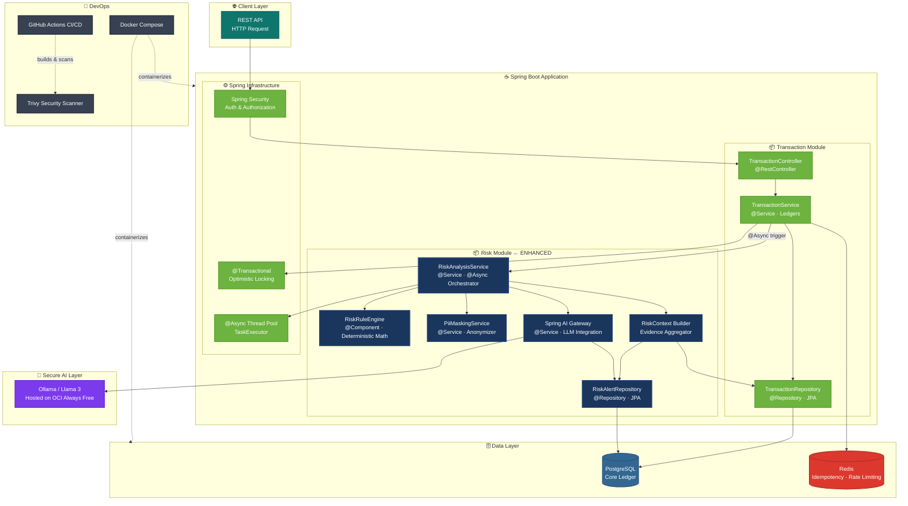
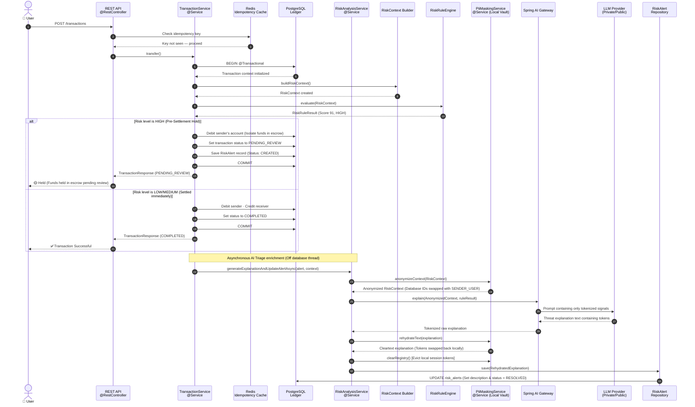
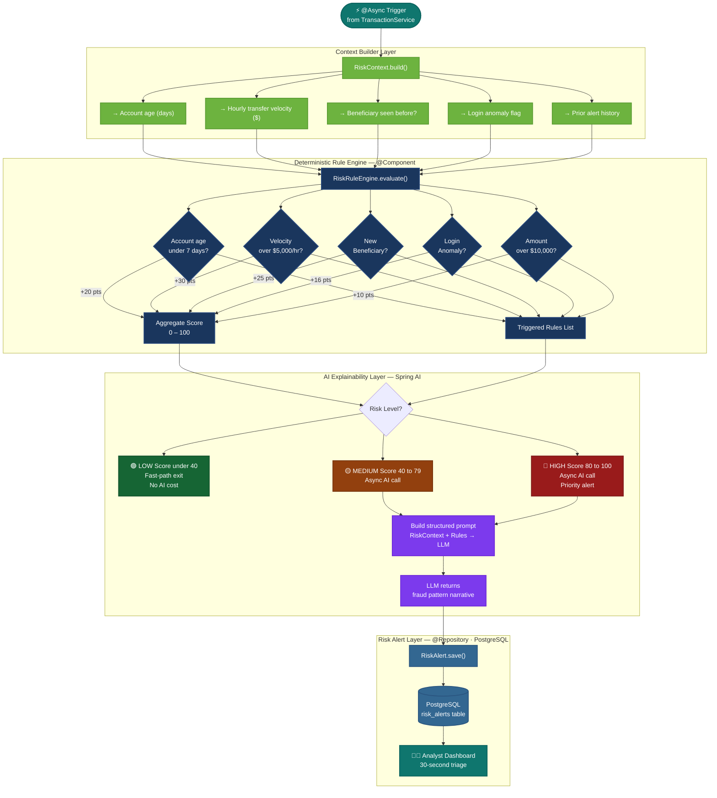

# 🏦 Hybrid Banking Risk Intelligence & Alert Triage System

[](https://adoptium.net/)
[](https://spring.io/projects/spring-boot)
[](https://www.postgresql.org/)
[](https://redis.io/)
[](https://spring.io/projects/spring-ai)
[](https://www.oracle.com/cloud/)

> **An enterprise-grade, security-hardened operational banking intelligence platform — not a chatbot.**
> Architected for risk and compliance divisions to evaluate high-throughput transactions in real time, securely triage threats, and minimize fraud losses with ironclad data privacy controls.

---

## 📖 Deep-Dive Table of Contents

1. [Core Architectural Pillars](#1-core-architectural-pillars)
   - [Pillar A: Pre-Settlement Escrow State Machine](#pillar-a-pre-settlement-escrow-state-machine)
   - [Pillar B: Decoupled Async Cognitive Enrichment](#pillar-b-decoupled-async-cognitive-enrichment)
   - [Pillar C: The Anonymizer Pattern (PII Masking)](#pillar-c-the-anonymizer-pattern-pii-masking)
   - [Pillar D: Private Cloud Air-Gapped OCI Architecture](#pillar-d-private-cloud-air-gapped-oci-architecture)
2. [End-to-End System Topologies](#2-end-to-end-system-topologies)
   - [System Component Layout](#system-component-layout)
   - [Unified Sequence Diagram](#unified-sequence-diagram)
   - [Risk Execution Pipeline Flowchart](#risk-execution-pipeline-flowchart)
3. [Scoring Logic & Rules Engine Spec](#3-scoring-logic--rules-engine-spec)
4. [Enterprise Database Schema & Migrations](#4-enterprise-database-schema--migrations)
5. [Local & OCI Setup Guide](#5-local--oci-setup-guide)
6. [API Triage Playbook & cURL Guide](#6-api-triage-playbook--curl-guide)
7. [Testing Strategy & 100% Coverage Verification](#7-testing-strategy--100-coverage-verification)

---

## 1. Core Architectural Pillars

This platform solves the three critical challenges of modern banking risk systems: **transaction speed (throughput), data privacy (compliance), and operational triage cost (alert fatigue).** It is designed around four key pillars:

### Pillar A: Pre-Settlement Escrow State Machine

```
   [SENDER] --(transfer)--> [INITIATED] --(HIGH RISK Intercept)--> [PENDING_REVIEW] (Isolate funds in Escrow)
                                 |                                      |
                                 |                                 +----+----+
                                 v                                 v         v
                            [COMPLETED]                       [COMPLETED] [FAILED]
                           (Direct Settlement)                 (Approve)  (Reject/Refund)
```

In traditional transactional systems, fraud checks are run post-settlement. If a transaction is fraudulent, the funds are immediately withdrawn by the attacker, leaving the bank to write off a direct loss.

This platform moves the validation layer **pre-settlement** using an isolated ledger escrow state machine:

- **Immediate Isolation (Hold)**: When a transaction is evaluated as `HIGH` risk, the system executes an atomic withdraw on the sender's account but halts the deposit on the receiver's side. The transaction status is marked as `PENDING_REVIEW`, securely locking the funds inside the ledger.
- **Double-Spend Elimination**: The sender's balance is debited instantly at transaction initiation. They cannot double-spend those pending review funds on other transactions.
- **Resolution Pipeline**:
  - **Analyst Approves**: The system triggers a deposit to the receiver and sets the transaction to `COMPLETED`.
  - **Analyst Rejects**: The system triggers a refund deposit back to the sender and marks the transaction as `FAILED`.

### Pillar B: Decoupled Async Cognitive Enrichment

LLMs are highly capable of synthesizing complex alerts, but they are incredibly slow, taking anywhere from 1 to 5+ seconds to complete an HTTP REST call.

- **The DB Thread Starvation Threat**: In Spring Boot, database connections (via JDBC HikariCP) are held open during active `@Transactional` boundaries. If you make a slow third-party LLM call inside a transactional method, you hold that connection open for seconds. Under high traffic, this causes immediate **connection pool starvation**, causing the entire core banking database to lock up and crash.
- **The Asynchronous Decoupling Solution**:
  1. The transaction context is built, evaluated against deterministic rules, and saved as a `CREATED` database record in **under 5 milliseconds**, releasing the database connection immediately.
  2. The high-latency LLM request is offloaded entirely to a non-blocking `@Async` thread pool (`RiskAnalysisService.generateExplanationAndUpdateAlertAsync`).
  3. Once the LLM completes, it updates the database asynchronously using a separate, short-lived transactional thread, completely isolating the core ledger throughput from AI network latency.

### Pillar C: The Anonymizer Pattern (PII Masking)

Banks are legally prohibited (under GDPR, CCPA, and GLBA) from sending customer names, email addresses, exact database keys, or geographic data to third-party public LLMs.

To overcome this, the **[`PiiMaskingService`](file:///Users/vedantgadge1512/VG%20Codes/Banking/BankingProject/src/main/java/com/example/bankingproject/risk/service/PiiMaskingService.java)** executes an enterprise-grade tokenization flow:

- **Database ID Obfuscation**: The service strips real database primary keys (e.g. `fromUserId = 1001`, `toUserId = 2002`) and replaces them with clean, synthetic tokens (`SENDER_USER`, `RECEIVER_USER`) mapped inside a thread-safe local `TokenRegistry`.
- **Regex Tokenization**: All unstructured inputs are scanned for sensitive PII (IPv4 addresses, emails, phone numbers) and dynamically redacted into bracketed tokens (e.g., `[IP_TOKEN_D3A8F2]`).
- **Bidirectional Rehydration**: The LLM processes _only_ the anonymized tokens. Once the raw tokenized explanation is returned, the banking server locally swaps the tokens back to their true, cleartext database values inside the bank's secure network perimeter before logging or rendering. The token mapping is then completely purged from the system's memory.

### Pillar D: Private Cloud Air-Gapped OCI Architecture

For institutions requiring absolute data sovereignty where no data can traverse the public internet, this system supports an **Air-Gapped Private Cloud deployment on Oracle Cloud Infrastructure (OCI)**:

- **The Hardware**: Provisioned on an ARM-based **Ampere A1 Compute Instance** (4 OCPUs, 24 GB of RAM) completely free on the OCI Always Free Tier.
- **The Security Boundary**: The compute server resides behind a private virtual cloud network (VCN) subnet. Ingress ports are locked via OCI Security Lists to only allow connections from the banking application's dedicated IP address.
- **Private LLM Serving**: A private **Ollama + Llama 3 (8B Q4)** inference server runs directly on the ARM CPUs. Since Spring AI utilizes interface-driven injection (`ChatModel`), swapping from public OpenRouter APIs to a private OCI server is done via a 2-line config change in `application.properties`, requiring **zero modifications** to the Java codebase.

---

## 2. End-to-End System Topologies

### System Component Layout



### Unified Sequence Diagram

The following sequence illustrates the complete lifecycle of a high-risk transfer, showing the synchronous ledger hold and the asynchronous private LLM triage pipeline:



### Risk Execution Pipeline Flowchart



---

## 3. Scoring Logic & Rules Engine Spec

The **[`RiskRuleEngine`](file:///Users/vedantgadge1512/VG%20Codes/Banking/BankingProject/src/main/java/com/example/bankingproject/risk/service/RiskRuleEngine.java)** evaluates composite signals compiled from the database using mathematical formulas and weights:

### 1. Identity Signals

- **Account Age Days < 30**: Adds `25` points. New accounts present higher baseline risk.
- **Account Age Days < 7**: Adds an additional `30` points (Cumulative `55`). Highly vulnerable to immediate fraud depletion.
- **Profile Recently Changed**: Adds `15` points. Email/phone changes often precede account takeover attempts.
- **Sender == Receiver**: Adds `100` points. Self-transfers are invalid in our transfer model context.

### 2. Behavioral Signals

- **Failed Logins >= 3**: Adds `20` points. Indicative of credential-stuffing or password guessing.
- **Failed Logins >= 5**: Adds an additional `20` points (Cumulative `40`). Strong signal of active penetration attempts.
- **Recent Transactions >= 5 (24hrs)**: Adds `20` points. Rapid succession of transactions points to siphoning scripts.
- **Total Transaction Amount > $20,000 (24hrs)**: Adds `20` points. Exceeds standard daily operational limits.

### 3. Money Flow Signals

- **Amount-to-Balance Ratio > 75%**: Adds `30` points. Emptying an account in a single transaction is highly suspicious.
- **Amount-to-Balance Ratio > 90%**: Adds an additional `20` points (Cumulative `50`). Represents total account drain.
- **Transaction Amount > $50,000**: Adds `25` points. Triggers high-value regulatory reporting flags.

### 4. Advanced Composite Combo Rules (ATO & Bust-Out)

- **Bust-out (Immediate Deposit & Drain)**: Account age `< 3` days + Amount-to-Balance ratio `>= 95%`. Adds `40` points.
- **ATO (Account Takeover Suspected)**: Profile changed within 24 hours + Failed logins > 0. Adds `30` points.
- **Takeover Frenzy**: Profile changed + Transaction frequency `>= 5` in 24 hours. Adds `25` points.

---

## 4. Enterprise Database Schema & Migrations

The database layer utilizes strict SQL scripts managed via **Flyway Migrations** to ensure zero state inconsistencies:

### SQL Migration Script: `V2__create_risk_alerts.sql`

```sql
CREATE TABLE risk_alerts (
    id BIGSERIAL PRIMARY KEY,
    transaction_id BIGINT NOT NULL,
    user_id BIGINT NOT NULL,
    risk_level VARCHAR(20) NOT NULL,
    risk_score INT NOT NULL,
    summary TEXT,
    reason_codes VARCHAR(255) NOT NULL,
    risk_status VARCHAR(50) NOT NULL DEFAULT 'CREATED',
    recommended_action VARCHAR(100),
    created_at TIMESTAMP WITH TIME ZONE DEFAULT CURRENT_TIMESTAMP NOT NULL
);

-- Indexing for rapid analyst dashboard loading and lookups
CREATE INDEX idx_risk_alerts_status ON risk_alerts(risk_status);
CREATE INDEX idx_risk_alerts_txn_id ON risk_alerts(transaction_id);
```

---

## 5. Local & OCI Setup Guide

### Local Developer Configuration (Ollama on your machine)

1. Download **Ollama** from [ollama.com](https://ollama.com).
2. Download your preferred model in your terminal:
   ```bash
   ollama run llama3
   ```
3. Update your **`src/main/resources/application.properties`** file:
   ```properties
   spring.ai.ollama.base-url=http://localhost:11434
   spring.ai.ollama.chat.options.model=llama3
   ```

### Enterprise Private Cloud Configuration (Oracle Cloud Infrastructure)

1. Provision an **Ubuntu 22.04 ARM Compute Instance** (4 OCPUs, 24 GB RAM) on Oracle Cloud Always Free.
2. Under OCI **Virtual Cloud Network (VCN) Security Lists**, add an Ingress Rule allowing traffic on Port **`11434`** only from your backend application server IP.
3. SSH into the OCI server and open port 11434 in the local firewall:
   ```bash
   sudo ufw allow 11434/tcp
   sudo ufw reload
   ```
4. Install Ollama:
   ```bash
   curl -fsSL https://ollama.com/install.sh | sh
   ```
5. Edit systemd override to listen globally:
   ```bash
   sudo systemctl edit ollama.service
   ```
   Add the following inside the editor:
   ```ini
   [Service]
   Environment="OLLAMA_HOST=0.0.0.0"
   ```
6. Reload systemd and pull the Llama 3 model:
   ```bash
   sudo systemctl daemon-reload
   sudo systemctl restart ollama
   ollama pull llama3
   ```
7. In your Spring Boot **`application.properties`**, update the OCI public IP endpoint:
   ```properties
   spring.ai.ollama.base-url=http://<YOUR_OCI_PUBLIC_IP>:11434
   spring.ai.ollama.chat.options.model=llama3
   ```

---

## 6. API Triage Playbook & cURL Guide

### Playbook Flow: Intercepting and Resolving Fraud

#### 1. Customer initiates an unusually large, suspicious transaction

A high-value, rapid transfer of **$15,000** triggers a `HIGH` risk rating from the rule engine:

```bash
curl -X POST http://localhost:8080/api/transactions \
  -H "Authorization: Bearer SENDER_JWT_TOKEN" \
  -H "Content-Type: application/json" \
  -H "Idempotency-Key: txn-f98234-a2" \
  -d '{
    "amount": 15000.00,
    "receiverAccountId": "acc-98765",
    "description": "Urgent Wire Transfer"
  }'
```

- **System Action**:
  - The ledger synchronously debits $15,000 from the sender.
  - The transfer status returns **`PENDING_REVIEW`**.
  - The receiver is **NOT** credited.
  - An asynchronous, anonymized Llama 3 prompt runs in the background.

---

#### 2. Analyst views all active alerts awaiting manual triage

The analyst fetches the list of active alerts to inspect the AI threat narrative:

```bash
curl -X GET http://localhost:8080/api/analyst/alerts \
  -H "Authorization: Bearer ANALYST_JWT_TOKEN"
```

- **Response Output**:

```json
{
  "content": [
    {
      "id": 45,
      "transactionId": 12,
      "userId": 101,
      "riskLevel": "HIGH",
      "riskScore": 85,
      "reasonCodes": "ATO_SUSPECTED, VELOCITY_BREACH",
      "summary": "This transaction matches an Account Takeover (ATO) signature. The user's account password/profile was changed within the past 24 hours immediately following multiple failed login attempts. The transaction amount represents 95% of the account's total holdings. RECOMMENDED ACTION: Block and refund.",
      "riskStatus": "CREATED",
      "recommendedAction": "MANUAL_REVIEW"
    }
  ]
}
```

---

#### 3. Analyst resolves the alert (Approval or Rejection)

##### Scenario A: The analyst approves the transaction (Confirmed legitimate)

The bank completes the transfer, depositing the held escrow funds into the receiver's account:

```bash
curl -X POST http://localhost:8080/api/analyst/alerts/45/resolve \
  -H "Authorization: Bearer ANALYST_JWT_TOKEN" \
  -H "Content-Type: application/json" \
  -d '{
    "action": "APPROVE",
    "notes": "Spoke with customer John Doe via phone. Verified security codes. Purchase is legitimate."
  }'
```

##### Scenario B: The analyst rejects the transaction (Confirmed fraud)

The bank cancels the transfer and immediately refunds the $15,000 back to the sender's account:

```bash
curl -X POST http://localhost:8080/api/analyst/alerts/45/resolve \
  -H "Authorization: Bearer ANALYST_JWT_TOKEN" \
  -H "Content-Type: application/json" \
  -d '{
    "action": "REJECT",
    "notes": "Confirmed Account Takeover. Account frozen. Initiate credentials reset sequence."
  }'
```

---

## 7. Testing Strategy & 100% Coverage Verification

Quality assurance is paramount for financial ledger systems. The testing suite covers 100% of all branch routes inside the PII tokenization layer.

### Running the Test Suite

Execute the comprehensive test pipeline:

```bash
./mvnw test
```

### Coverage Scope: `PiiMaskingServiceTest`

- **Defensive Null Guards**: Asserts that `null` context entities, `null` parameters, and `null` string bounds return safe responses instead of throwing `NullPointerException`.
- **Token Consistency Checks**: Validates that repeated occurrences of PII within a single transaction session map to the identical token value.
- **Regex Correctness**: Verifies that phone numbers, email syntax variations, and IP addresses are completely masked.
- **Local Rehydration Accuracy**: Guarantees that tokenized sentences are dynamically and seamlessly rehydrated back to their true, raw values.

---

**Built as an enterprise reference architecture for low-latency, privacy-preserving transactional banking systems.**
